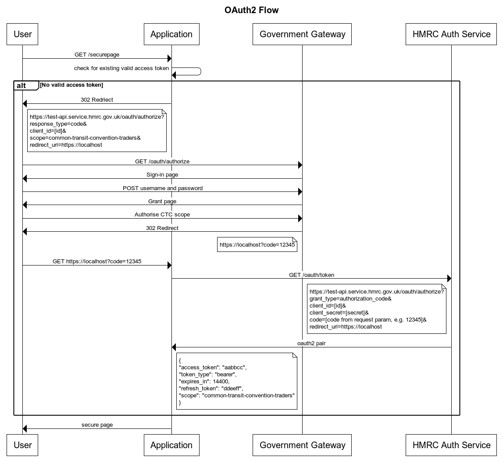

# Common Transit Convention Traders Example API Client

The Common Transit Convention Traders API uses the OAuth2 protocol via the Government Gateway to authenticate users.  Users must also be enrolled to NCTS.

This version of the code so far only demonstrates how to;
- redirect to the Government Gateway sign-in pages
- submit a sample IE015 XML

We are working on other pages to retrieve and updated departure movements.

There are no plans to create example pages for arrival movements because the principle is the same as departures.

## The Example Application

This example code runs Spring Boot with an Apache Wicket UI framework and requires Java 11 to run.  

It is configured to run using the [HMRC Sandbox environment](https://developer.service.hmrc.gov.uk/api-documentation/docs/testing).

### HTTPS setup
The sign-in flow requires a secure https URL to redirect to after a successful (or failed) login attempt.  The Java application listens on http port 8088 by default so the easiest way to provide https is to add a reverse proxy.  It's beyond this readme to go through all the steps to configure a reverse proxy but basically you'll need to create an SSL certificate and configure routing on your chosen proxy.

It is beyond the scope of this readme to explain nginx installation but once installed on a Mac, I would generate a local certificate:

```
sudo openssl req -x509 -nodes -days 365 -newkey rsa:2048 \
-keyout /usr/local/etc/nginx/cert.key -out /usr/local/etc/nginx/cert.crt
```

and then edit the /usr/local/etc/nginx/nginx.conf file to add the reverse proxy:

	server {

	    listen 443;
	    server_name localhost;
	
	    ssl_certificate           /usr/local/etc/nginx/cert.crt;
	    ssl_certificate_key       /usr/local/etc/nginx/cert.key;
	
	    ssl on;
	    ssl_session_cache  builtin:1000  shared:SSL:10m;
	    ssl_protocols  TLSv1 TLSv1.1 TLSv1.2;
	    ssl_ciphers HIGH:!aNULL:!eNULL:!EXPORT:!CAMELLIA:!DES:!MD5:!PSK:!RC4;
	    ssl_prefer_server_ciphers on;
	
	    location / {
	
	      proxy_set_header        Host $host;
	      proxy_set_header        X-Real-IP $remote_addr;
	      proxy_set_header        X-Forwarded-For $proxy_add_x_forwarded_for;
	      proxy_set_header        X-Forwarded-Proto $scheme;
	
	      # Fix the “It appears that your reverse proxy set up is broken" error.
	      proxy_pass          http://localhost:8088;
	      proxy_read_timeout  90;
	
	      proxy_redirect      http://localhost:8088 https://localhost;
	    }
	  }
	server {
	
	    listen 80;
	    server_name localhost;
	
	    location / {
	
	      proxy_set_header        Host $host;
	      proxy_set_header        X-Real-IP $remote_addr;
	      proxy_set_header        X-Forwarded-For $proxy_add_x_forwarded_for;
	      proxy_set_header        X-Forwarded-Proto $scheme;
	
	      # Fix the “It appears that your reverse proxy set up is broken" error.
	      proxy_pass          http://localhost:8088;
	      proxy_read_timeout  90;
	
	      proxy_redirect      http://localhost:8088 http://localhost;
	    }
	  }
	    include servers/*;
	}

nginx will then need restarting/reloading to pickup the new config.

### Sign Up for an Account
If you don't already have a Developer Hub account, go to [https://test-developer.service.hmrc.gov.uk/developer/registration]("https://test-developer.service.hmrc.gov.uk/developer/registration")

### Dev Hub create application
Before starting the Java example, you will need to sign-up for a HMRC application on the HMRC Sandbox environment.

Sign in to your Developer Hub account and add an application here [https://test-developer.service.hmrc.gov.uk/developer/applications]("https://test-developer.service.hmrc.gov.uk/developer/applications")

Steps to create an application:
- Select *Add an application to the sandbox* and follow the instructions
- *What's the name of your application*' give the application a name
- *Which APIs do you want to use?* subscribe to `Common Transit Convention Traders` and `Create Test User`, then click *Add your application*
- *Configure your API subscriptions* click *Continue*
- Enter information specific to your API
- You will be asked if you want to receive emails about your selected APIs
- *Which topics do you want to receive information about?* you must select at least one, then click *Continue*
- *Application added to the sandbox*

You can now view your application credentials. 
Make a note of your *Client ID*.
You will be prompted to generate a *Client secret*, again make a note of it.

You can now select *View your application details*

Once you have an application, there will be tabs which include Details and Testing Credentials.  
Add `https://localhost` as a *Redirect URI* from the *Redirect URIs* menu.

You will need the Client ID and Secret from the *Testing Credentials* tab for the configuration below.

### Application configuration
Clone the example code from github

```
git clone https://github.com/hmrc/ctc-traders-example-java-client.git
```

### Start the application
The application is based on Spring Boot.  Assuming you have java 11 and maven installed, you can go to the root folder of the project code and run

```
cd ctc-traders-example-java-client
mvn clean spring-boot:run -Dspring-boot.run.arguments="--tax.clientId=[YOUR CLIENT ID] --tax.secret=[YOUR SECRET]"
```

Obviously, change the values for your client id and your secret.

Note that the application will not start if you don't supply the tax.clientId and tax.secret parameters.

### Create a test user

A test user (Trader) will need to sign-in and grant access to the example client for the Common Transit Convention Traders scope.  Since we are running against the HMRC Sandbox environment and need the NCTS enrolment, you have to use the create-test-user API.

If you've not already generated a test user login, first generate an access token:

```
export CLIENT_ID=[your client id]
export CLIENT_SECRET=[your client secret]
export API_URL=https://test-api.service.hmrc.gov.uk

export ACCESS_TOKEN=`curl -H "content-type: application/x-www-form-urlencoded" --data \
"client_secret=${CLIENT_SECRET}\
&client_id=${CLIENT_ID}\
&grant_type=client_credentials\
&scope=common-transit-convention-traders" \
$API_URL/oauth/token | jq -r '.access_token'`
```

This will populate the ACCESS_TOKEN environment variable.  You will need to have jq installed for the above command to work directly.  Alternatively, you can run the curl command without jq and copy the value.

Then you create a new test user:

```
curl \
$API_URL/create-test-user/organisations \
-H 'accept: application/vnd.hmrc.1.0+json' \
-H 'Content-Type: application/json' \
-H 'cache-control: no-cache' \
-H "Authorization: Bearer ${ACCESS_TOKEN}" \
-d '{"serviceNames": [ "common-transit-convention-traders" ] }'
```

which will generate and return a new test user with a username and password.  Note/copy these for use later.

### Running the client

Assuming that everything is running right, you should be able to open a web browser and go to [https://localhost/]("https://localhost/")


You should be redirected to the Government Gateway login page.  Login as your test user and grant the scope then you will be redirected back to the example client home page.


## Sequence Diagrams

### Auth flow
See the [Developer Hub](https://developer.service.hmrc.gov.uk/api-documentation/docs/authorisation/user-restricted-endpoints) for more information.


### Submit Departure Declaration


## License

This code is open source software licensed under the [Apache 2.0 License]("http://www.apache.org/licenses/LICENSE-2.0.html").

## Feedback

If you have any suggestions, requests or discover any bugs, please use the github issues page to communicate with us.

[https://github.com/hmrc/ctc-traders-example-java-client/issues]("https://github.com/hmrc/ctc-traders-example-java-client/issues")
